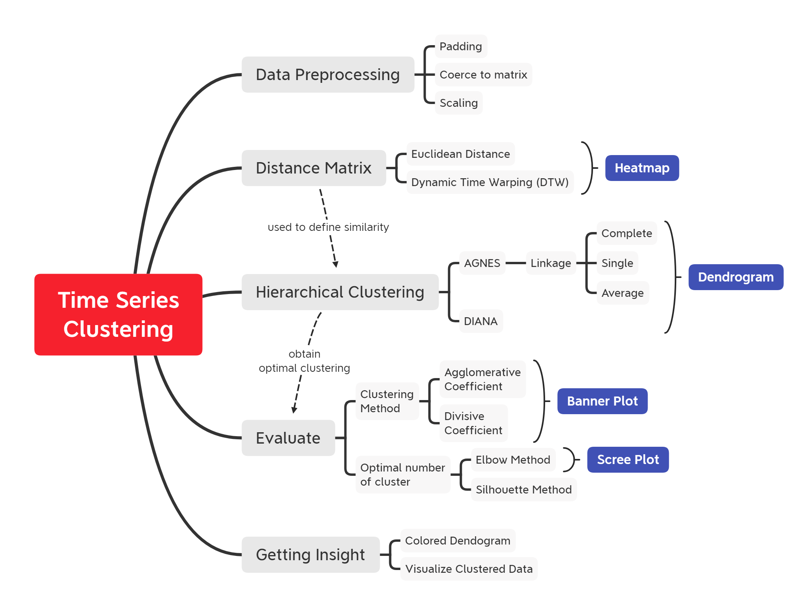

# Time Series Clustering

This repository contains curated material for Time Series Clustering using Hierarchical-Based Clustering Method. The primary objective of this course is to provide a comprehensive implementation for time series clustering analysis to **understand the process of grouping time series data into a similar pattern** using the R programming language. The syllabus covers:

* **Overview of Clustering**

* **Time Series Clustering**
    + Data Collection
    + Preprocessing data time series
    + Exploratory Data Analysis 
    + Distance Matrix
      - Euclidean Distance
      - Dynamic Time Warping

* **Hierarchical Clustering**
    + Agglomerative Nesting (AGNES)
      - Agglomerative Coefficient (AC)
      - Linkage
    + Divisive Analysis (DIANA)
      - Divisive Coefficient (DC)
    + Working with Dendrograms

* **Determine Optimal Cluster**
    + Scree plot
    + Silhouette
    
* **Communicate insights for business needs**

