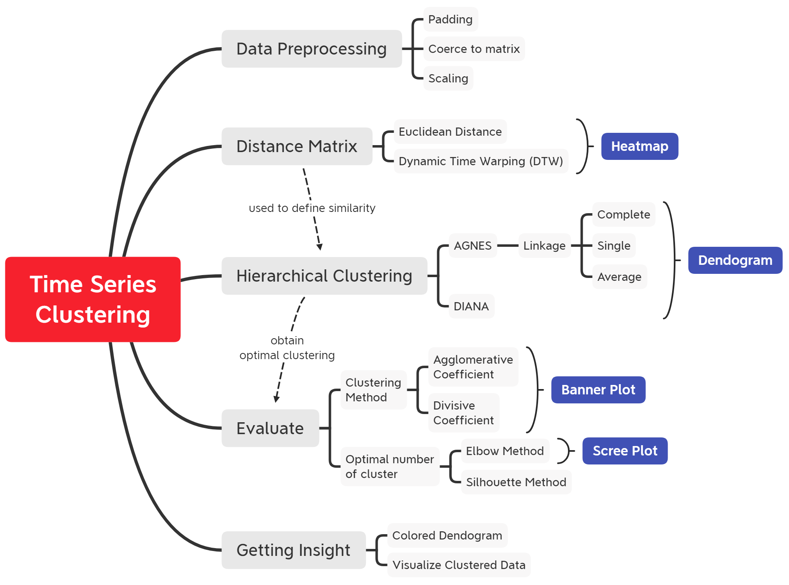
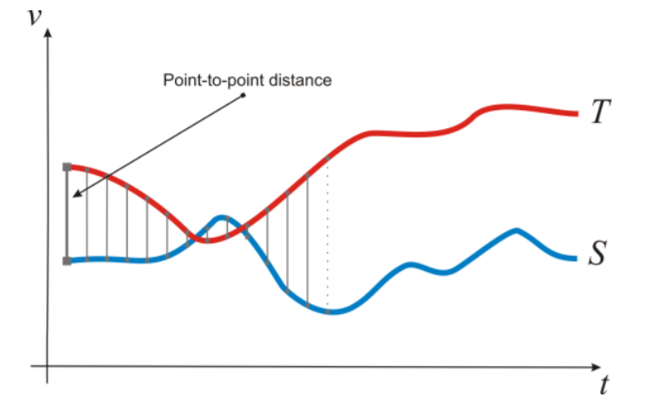
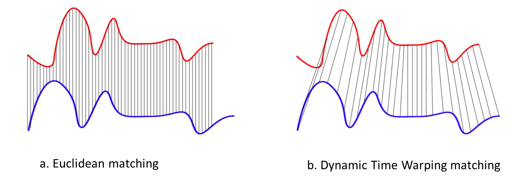
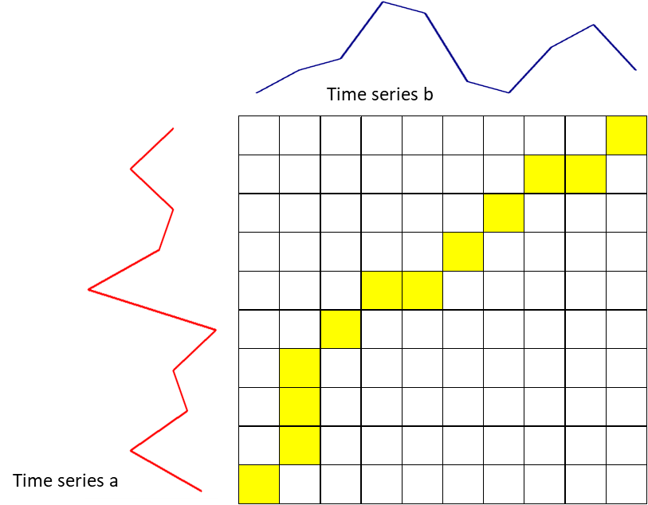
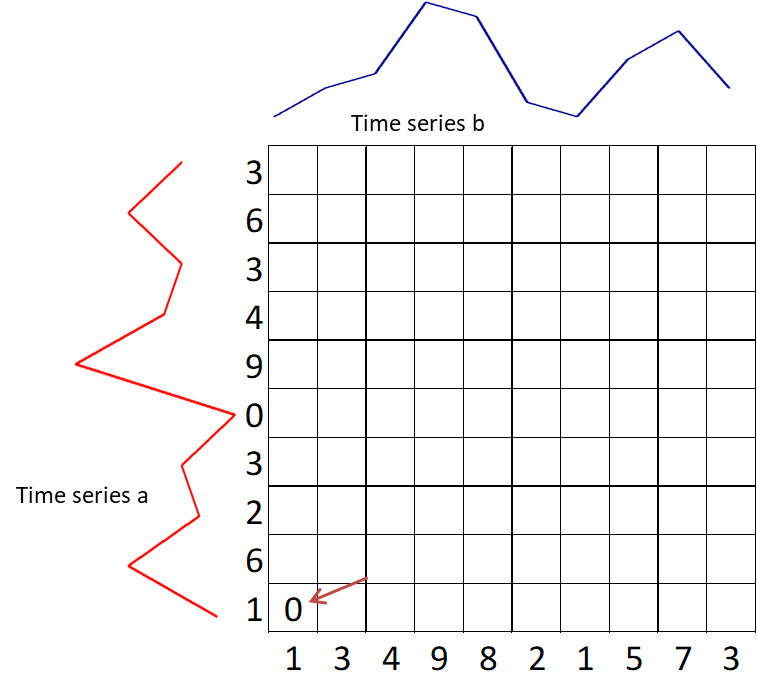
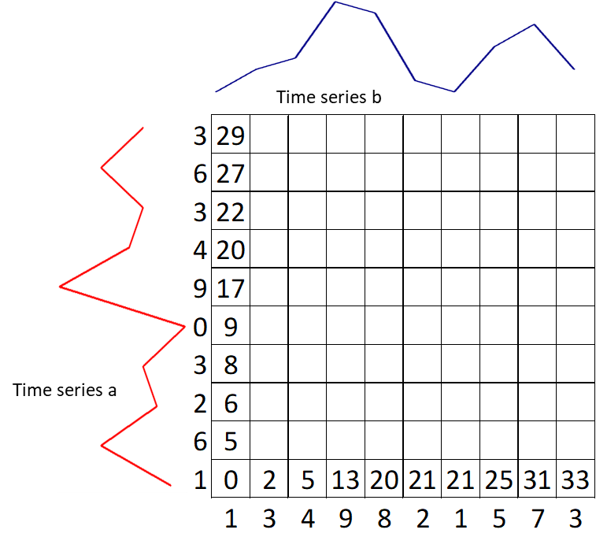
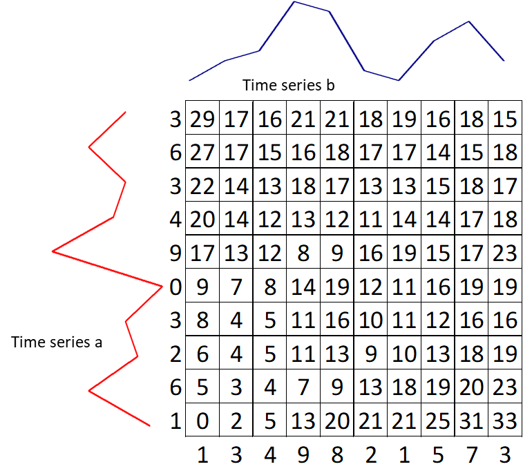
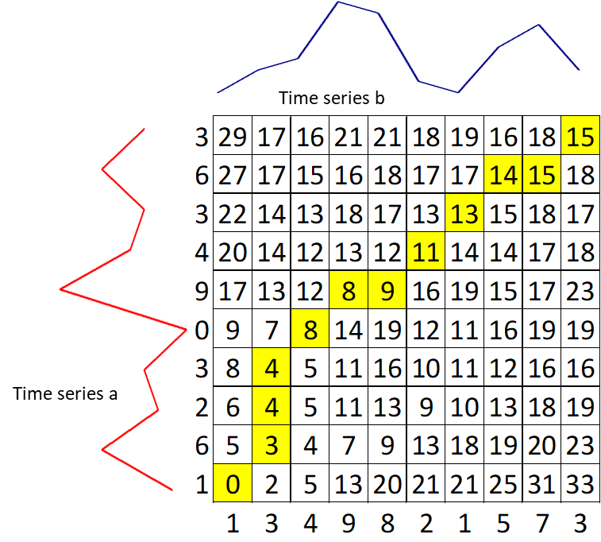
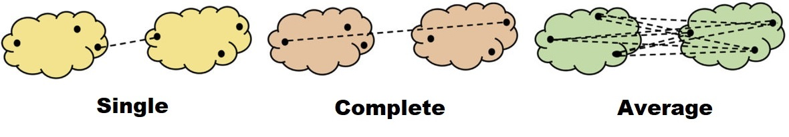
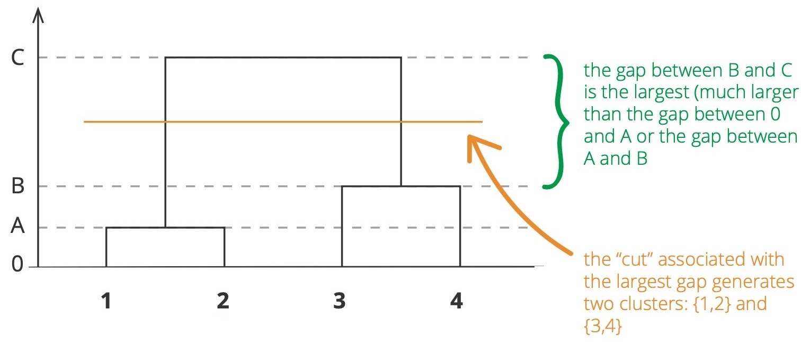

```{r setup, include=FALSE}
# clean up the environment
rm(list = ls())

# setup chunk options
knitr::opts_chunk$set(
  message = FALSE,
  warning = FALSE,
  fig.align = "center",
  comment = "#>"
)

options(scipen = 9999)
```

<style>
body {
text-align: justify}
</style>

# Preface {.tabset}

## Training Objectives

This course is specially curated for _Permata Bank_ Corporate Training Workshops on **Machine Learning Specialization**. The primary objective of this course is to provide a comprehensive implementation for time series clustering analysis to **understand the process of grouping time series data into a similar pattern** using the R programming language. The syllabus covers:

* **Overview of Clustering**

* **Time Series Clustering**
    + Data Collection
    + Preprocessing data time series
    + Exploratory Data Analysis 
    + Distance Matrix
      - Euclidean Distance
      - Dynamic Time Warping

* **Hierarchical Clustering**
    + Agglomerative Nesting (AGNES)
      - Agglomerative Coefficient (AC)
      - Linkage
    + Divisive Analysis (DIANA)
      - Divisive Coefficient (DC)
    + Working with Dendrograms

* **Determine Optimal Cluster**
    + Scree plot
    + Silhouette
    
* **Communicate insights for business needs**

```{r, out.width = "80%", echo = FALSE, fig.align = "center"}

```

***

## Library and Setup

In this **Library and Setup** section you’ll see some code to initialize our workspace, and the packages we’ll be using for this project. 

_Packages_ are collections of R functions, data, and compiled code in a well-defined format. The directory where packages are stored is called the _library_. R comes with a standard set of packages. Others are available for download and installation. Once installed, they have to be loaded into the session to be used. 

You will need to use `install.packages()` to install any packages that are not yet downloaded onto your machine. Then you need to load the package into your workspace using the `library()` function:

```{r}
library(tidyverse)
library(lubridate)
library(RSocrata)
library(tidyverse)
library(lubridate)
library(zoo) 
library(padr)
library(imputeTS)
library(ggplot2)
library(plotly)
library(tibble)
library(TSclust)
library(gplots)
library(cluster)
library(factoextra)
library(dendextend)
```

***

# Overview Clustering Analysis

Cluster analysis is one of the tools in the data mining process that aims to group objects into a cluster. The cluster itself is a group or a set of data objects that are similar to each other in the same group. The purpose of cluster analysis is not to correlate objects one with another object, but to identify a group of objects which have similarities and distinctive characteristics that can be separated from other groups.

Objects that are in the same cluster are relatively more homogeneous than objects that are in different clusters. Several groups that can be identified depending on the lot and the variance of the object data. The cluster results are said to be good with the following characteristics: 

1. Has great homogeneity between members in the same cluster (within a cluster).
2. Has great heterogeneity between one cluster and another (between-cluster).

**Key elements of the definition**

- Data objects
- Group
- Similarity

# Time Series Clustering

In the previous chapter, the clustering analysis module was applied to static data whose features did not change over time. Today many applications store data for long periods of time. As a result, time-series data is created in various fields. Clustering can be applied to this time series to gain insight into the data. For example, retailers can group product sales time series to determine which products exhibit similar sales behavior. However, as seen from the previous chapter, common clustering methods such as *k-means* is not designed for time series data and therefore may not function properly.

Next, we address the limitations of the Euclidean distance when comparing time series and present alternatives that overcome these limitations.

## Similarity Measure

A common data mining task is the estimation of similarity among objects. A similarity measure is a relation between a pair of objects and a scalar number. Common intervals used to mapping the similarity are [-1, 1] or [0, 1], where 1 indicates the maximum of similarity.

Common similarity functions used to perform complete or partial matches between time series are the cross-correlation function (or Pearson's correlation function) and the cosine angle between two vectors. The cross-correlation between two time-series $x$ and $y$ of length $n$, allowing a shifted comparison of $l$ positions, is defined as:

$$r_{XY}=\dfrac{\sum^n_{i=1}(x-\bar{X})(y-\bar{Y})}{\sqrt{\sum^n_{i=1}(x_i-\bar{X})^2} \sqrt{\sum^n_{i=1}(y_{i}-\bar{Y})^2}}$$

where $\bar{X}$ and $\bar{Y}$ are the means of $X$ and $Y$. The correlation $\rho_{XY}$ provides the degree of linear dependence between the two vectors $X$ and $Y$ from perfect linear relationship ($\rho_{XY}$ = 1), to perfect negative linear relation ($\rho_{XY}$ = -1). [^1]

### Metric Distance

Another way to compare time series data involves the concept of distance measures. Let be two time series $T$ and $S$ vectors of length $n$, and $T_i$ and $S_i$ the $i$-th values of $T$ and $S$, respectively. Let us list the following distance measures. This subsection presents a list of distance functions used in Euclidean space [^1]. 

$$T = t_1, t_2, t_3, ...., t_i$$ 
$$S = s_1, s_2, s_3, ...., s_i$$

If we want to compare two time series, we can use the Euclidean distance as follows:

$$ED(T,S) = \sqrt{\sum^n_{i=1}(t_i - s_i)^2}$$

This distance measurement is visualized in the following figure:

```{r, out.width = "80%", echo = FALSE, fig.align = "center", fig.cap="$T$ and $S$ are two time series of a particular variable $v$, along the time axis $t$"}

```

The Euclidean distance results in the sum of the point-to-point distances (gray lines), along with all the time series. Euclidean distance present several drawbacks, that make inappropriate their use in certain applications:

- It compares only time series of the same length.
- It doesn’t handle outliers or noise. 

### Dynamic Time Warping 

Dynamic Time Warping (DTW) gives more robustness to the similarity computation. By this method, also time series of different length can be compared, because it replaces the one-to-one point comparison, used in Euclidean distance, with a many-to-one (and vice-versa) comparison. The main feature of this distance measure is the ability to recognize similar shapes, even if they present signal transformations, such as shifting and/or scaling. [^1]

> The idea of DTW is to compare arrays with different lengths to build one-to-many and many-to-one matches so that the total distance can be minimized between the two.

Suppose we have two red and blue time-series with different length:

```{r, out.width = "70%", echo = FALSE, fig.align = "center", fig.cap="Difference between DTW distance and Euclidean distance"}

```

These two time-series follow the same pattern, but the blue is longer than the red. If we apply the Euclidean (one-to-one) matching, the mapping is not perfectly synchronized and the blue curve tail is left out. DTW overcomes the issue by developing a one-to-many matching so that the troughs and peaks with the same pattern are perfectly matched, and there is no left out for both curves.

**Rules:**

In general, DTW is a method that calculates an optimal match between two given sequences (e.g. time series) with certain restriction and rules (*References from Wiki*):

- Every index from the first sequence must be matched with one or more indices from the other sequence and vice versa.
- The first index from the first sequence must be matched with the first index from the other sequence (but it does not have to be its only match).
- The last index from the first sequence must be matched with the last index from the other sequence (but it does not have to be its only match).
- The mapping of the indices from the first sequence to indices from the other sequence must be monotonically increasing, and vice versa, i.e. if $j > i$ are indices from the first sequence, then there must not be two indices $l > k$ in the other sequence, such that index $i$ is matched with index $l$ and index $j$ is matched with index $k$, and vice versa.

The optimal match is denoted by the match that satisfies all the restrictions and the rules and that has the minimal cost, where the cost is computed as the sum of absolute differences, for each matched pair of indices, between their values.

#### [Optional] DTW Algorithm

Suppose we have two example time series data: `series_a` and `series_b`. 

```{r}
series_a <- c(1,6,2,3,0,9,4,3,6,3)
series_b <- c(1,3,4,9,8,2,1,5,7,3)
```

```{r}
plot(series_a, type = "l", col = "red", lwd = 3)
lines(series_b, col = "darkblue", lwd = 3)
```

The basis of DTW is on the computations of the distance between the two time-series, which illustrated by the figure below. Values of time series A has been plotted in the y-axis and values of time series B have been plotted in the x-axis. The best alignment is shown in the yellow area. To find the best alignment between A and B, we need to find the path through the grid. 
 
```{r, out.width = "70%", echo = FALSE, fig.align = "center", fig.cap="DTW Algorithm"}

```

Here are the mathematical notation:

- $i$: horizontal index (for time series b), starting from 1
- $j$: vertical index (for time series a), starting from 1
- $g(i,j)$: the grid value at index $i$ and $j$
- $d(i,j)$: difference of time-series value at index $i$ and $j$

1. Start with the calculation of $g(1,1) = d(1,1)$.

```{r, out.width = "70%", echo = FALSE, fig.align = "center", fig.cap="DTW Algorithm (Step 1)"}

```

2. Calculate the first row $g(i, 1) = g(i–1, 1) + d(i, 1)$
3. Calculate the first column $g(1, j) = g(1, j) + d(1, j)$

```{r, out.width = "70%", echo = FALSE, fig.align = "center", fig.cap="DTW Algorithm (Step 2 and 3)"}

```

4. Move to the second row $g(i, 2) = min(g(i, 1),\ g(i–1, 1),\ g(i–1, 2)) + d(i, 2)$. Keep the value for each cell the index of this neighboring cell, which contributes the minimum score.

5. Keep filling the values on the grid from left to right and bottom to top with the formula:  $g(i,j) = min(g(i, j–1),\ g(i–1, j–1),\ g(i–1, j)) + d(i, j)$

```{r, out.width = "70%", echo = FALSE, fig.align = "center", fig.cap="DTW Algorithm (Step 4 and 5)"}

```

6. Trace back the best path through the grid starting from $g(n, m)$ towards $g(1,1)$ and we get a yellow area. We can conclude that the distance between time series a and b is $g(n, m) = 15$.

```{r, out.width = "70%", echo = FALSE, fig.align = "center", fig.cap="DTW Algorithm (Step 6)"}

```

## Application of Time Series Clustering

### Read Data

The data is collected from [**Chicago Taxi Data**](https://data.cityofchicago.org/Transportation/Taxi-Trips/wrvz-psew). Each row in the dataset describes a distinct taxi trip and shows:

- Which taxi provided the trip
- What times the trip started and ended
- Length of the trip in both time and distance
- Starting and ending Community Area — plus Census Tract for many trips
- Fare amount and other components of the trip cost
- Type of payment — such as cash or credit card. (As an important note, cash tips are not included in the data because they do not go through the payment systems.)
- Taxi company

But in this analysis, we will only focus on two columns; the date of each trip `trip_start_timestamp` and pickup area `pickup_community_area`.

```{r}
df <- readRDS("data/taxy_cgg.RDS")
colnames(df)
```

### Data Preprocessing    

We have to prepare the data first. One of the common problems we faced in Data Preparation is handling the missing value (`NA`). In this case, we will remove all data for an observation that has missing value on `pickup_community_area`. Then we consider *rounding* our data into `year-month` format and doing *date padding* to the further analysis. Here I give you the example of time series padding:

```{r}
n_order_example <- data.frame(
  day = as.Date(c('2016-10-21', '2016-10-23', '2016-10-26')),
  order = c(304.46, 414.76, 378.98))

n_order_example
```

We will use the `pad` function to insert missing date information from our data series. the function will notices that within the day interval, in this case, rows are lacking between the first and last observation. It inserts a row in the data frame for every time point that is lacking from the data set. All non-datetime values will get missing values at the padded rows.

```{r}
pad(n_order_example)
```

We need to calculate the number of orders in each `trip_start` and `picking_community_area`. To make it more concise, here is the quick summary for the data preparation step:

- Remove NA `pickup_community_area`
- Consider monthly `trip_order`
- Padding for each group from `start_val` to `end_val`

```{r}
agg <- 
  df %>%
  filter(pickup_community_area != 'NA') %>% 
  mutate(trip_start = as.Date(as.yearmon(trip_start_timestamp)),
         pickup_community_area = as.factor(as.numeric(pickup_community_area))) %>% 
  group_by(trip_start, pickup_community_area) %>% 
  summarise(total_order = n()) %>%
  ungroup()

agg_pad <-
  agg %>% 
  group_by(pickup_community_area) %>% 
  pad(
      start_val = range(agg$trip_start)[1],
      end_val = range(agg$trip_start)[2]) %>% 
  fill_by_value()

agg_pad
```

### Exploratory Data Analysis

After making sure the data is ready, we do an exploratory data analysis for the historical number of orders for each area. We can give consideration visually, which areas have almost similar historical patterns.

```{r}
ts_ggplot <-
  ggplot(agg_pad, 
       aes(x = trip_start,
           y = total_order,
           color = pickup_community_area)) +
  geom_line() +
  labs(title = "Monthly Taxi Order by Area") + 
  scale_color_viridis_d() +
  theme_minimal() +
  theme(
    legend.position = "none"
  )

ggplotly(ts_ggplot)
```

```{r}
order <-
  agg_pad %>% 
  pivot_wider(id_cols = trip_start,
              names_from = pickup_community_area,
              values_from = total_order) %>% 
  column_to_rownames(var="trip_start")

head(order)
```

In the pre-processing stage, especially in calculations similarity between data, it's a good way to normalize all the variables to bring them down to a similar scale. So we can compare two series patterns, instead of looking at their true values. To make it clear, please see the following breakdown:

```{r}
order_scaled <- scale(order)
matplot(order_scaled, type = 'l')
```

```{r}
subset_area <- c('32','8')
subset_order_scaled <- order_scaled[,subset_area]
matplot(subset_order_scaled, type = 'l')
legend("topright", colnames(subset_order_scaled),
       col = seq_len(length(subset_area)),
       lty = seq_len(length(subset_area)))
```

In the picture above, the two `pickup_community_area` (8 & 32), which were originally quite different due to the number of order (units), after normalize the data *scale* we can see that they have similar patterns from time to time.

### Calculate Distance Matrix

Next, we create a custom function for calculating the distance matrix. The defined input argument is `mat`, which is the scaled time series matrix. `method` is the calculation approaches used, which is in this case will be compared euclidean and dynamic time warping distance. The result output is a heat map matrix for each area. The redder the color, the two areas are similar to each other, so we can say the pattern is almost similar.

```{r}
distance_matrix <- function(mat, method, dendrogram = F){
  dm <- diss(SERIES = mat, METHOD = method)
  heatmap.2(as.matrix(dm), trace = "none",
            Colv = dendrogram, Rowv = dendrogram)
  
  return(dm)
}
```

```{r}
eucl <- distance_matrix(t(order_scaled), "EUCL")
```

```{r}
dtw <- distance_matrix(t(order_scaled), "DTWARP")
```

# Hierarchical Clustering

On the Unsupervised Learning course, we have seen that the results of using the K-means clustering algorithm depends on the pre-specified number of clusters K and random starting cluster assignment. In contrast, hierarchical clustering doesn't require such specifications - It is a **deterministic** approach which produces the same clustering each time. Instead, we have to specify a measure of pairwise dissimilarity (or **distance matrix**) between observations in two groups. Euclidean distance is commonly used because it is intuitive to humans, but it is possible to use other distance matrix depending on the case. We will also compare the clustering result using Dynamic Time Warping.

As the name suggests, hierarchical clustering outputs an attractive tree-based representation of the observations, called **dendrogram**. This provides a highly interpretable complete description of the clustering in a graphical format. On dendrogram, the clusters at each level of the hierarchy are created by merging clusters at the next lower level, where:

- At the lowest level (often referred as the leaves), each observation is treated as single cluster.
- At the highest level (often referred as the trunk), there is only one cluster containing all observations.

```{r, out.width = "80%", echo = FALSE, fig.align = "center", fig.cap="Dendrogram [^2]"}
knitr::include_graphics("assets/dendrogram.png")
```

The strategy of hierarchical clustering is divided into two basic paradigms:

1. Agglomerative Nesting (AGNES) or bottom-up clustering
2. Divisive Analysis (DIANA) or top-down clustering

We are going to focus more on AGNES since it is the most common type of hierarchical clustering. The same concept will be applied to DIANA, except it is in reversed order.

## Agglomerative Nesting (AGNES)

AGNES is a bottom-up approach of hierarchical clustering. The algorithm is in fact very simple, it begins with every observation as a single cluster, we can refer to this state as the leaves on the dendrogram. Let $N$ be the number of observations. At each of the $N-1$ steps, the closest two (or the least dissimilar) clusters will be merged as a single cluster - producing one less cluster.

Before any further concept, let's compare the result of Agglomerative clustering using Euclidean versus Dynamic Time Warping. We use [`agnes()`](https://www.rdocumentation.org/packages/cluster/versions/2.1.0/topics/agnes) function from `cluster` package. The default linkage method is "average", we will discuss this concept later on this course. Dendrogram can be plotted by specifying the parameter `which.plots = 2` inside `plot()` function. Note: we can alternatively use [`hclust()`](https://www.rdocumentation.org/packages/stats/versions/3.6.2/topics/hclust) from `stats` package that should produce the same clusters.

```{r fig.width=18, fig.height=12}
par(mfrow = c(1, 2))

eucl_agnes <- agnes(eucl)
plot(eucl_agnes, main = "Euclidean Distance", which.plots = 2)

dtw_agnes <- agnes(dtw)
plot(dtw_agnes, main = "Dynamic Time Warping", which.plots = 2)
```

From the plot above, we can see that the choice of a distance matrix greatly affects the structure of the dendrogram. Using the Euclidean distance, most of the clusters are being merged at a larger distance (height > 5). This results in a dendrogram that has a tighter structure than using Dynamic Time Warping, where the merging process occurs on the early stage. The compactness of the dendrogram can be quantified by using **Agglomerative Coefficient** which is often used as a measure of the clustering structure.

### Agglomerative Coefficient (AC)

The agglomerative coefficient measures the height of observation to the first cluster it joins, divided by the height of the final merger in the cluster analysis, and then averaged across all observations. It ranges from 0 to 1 where lower value reflects tight and less well-formed clusters, whereas larger value indicates a more balanced and stronger clustering distinction. However, AC tends to increase with sample sizes, so it should not be used to compare clustering across different data sets with varying sizes.

By defining parameter `which.plots = 1`, we can observe the **banner plot**. It is a horizontal barplot which captures the height values in the dendrogram for each observation but rotated by 90 degrees clockwise. To put it simpler, AC is the average width of the red bars.

```{r fig.width=18, fig.height=12}
par(mfrow = c(1, 2))

plot(eucl_agnes, which.plots = 1, nmax.lab = Inf)
plot(dtw_agnes, which.plots = 1, nmax.lab = Inf)
```

In conclusion, we will continue the course with Dynamic Time Warping since the AC is larger, indicating more balanced clusters.

### Linkage

Imagine we are in the later step of the merging process, where there are two or more observations contained in a cluster. The problem is: how do we measure the distance between those two clusters? Are we going to consider only one observation or the whole observations in the cluster? The answer to this problem is **linkage**, where the measure of the distance between two clusters must be defined. A numerous linkage methods have been developed, but we will only cover the three most commonly used:

```{r, out.width = "80%", echo = FALSE, fig.align = "center", fig.cap="Types of Linkage [^3]"}

```

- Single linkage: the resulting distance is based on the closest (least dissimilar) pair of observations. This is often called as a nearest-neighbor method.
- Complete linkage: the resulting distance is based on the furthest (most dissimilar) pair of observations. This is often called as a furthest-neighbor method.
- Average linkage: the average pairwise distance between two clusters. If there are 3 observations in each of the two clusters, then there are 9 pairs of the distance needed to be averaged.

```{r fig.width=18, fig.height=10}
par(mfrow = c(1, 3))

dtw_agnes_complete <- agnes(dtw, method = "complete")
plot(dtw_agnes_complete, main = "Complete Linkage", which.plots = 2)

dtw_agnes_single <- agnes(dtw, method = "single")
plot(dtw_agnes_single, main = "Single Linkage", which.plots = 2)

dtw_agnes_average <- agnes(dtw, method = "average")
plot(dtw_agnes_average, main = "Average Linkage", which.plots = 2)
```

The choice of linkage method entirely depends on the user. There is no solid method that will always give good cluster results. Using different linkage methods will lead to different clustering result.

**Discussion**

1. According to the dendrogram above, which linkage method should give optimal clustering results, and why?

2. If we were using Euclidean instead of Dynamic Time Warping, which linkage method is preferred among the three? How is the comparison between the two distances?

```{r}
# your code here

```

## Divisive Analysis (DIANA)

On the other hand, DIANA is a top-down approach of hierarchical clustering. It starts with the entire observations as a single cluster and recursively divides one of the existing clusters into two separate clusters.

In the earlier development of the DIANA algorithm, the split at each iteration can be done by recursively applying 2-means clustering. However, this approach will not be deterministic anymore since it would depend on the random starting configuration - hence, no monotonicity.

A divisive algorithm that avoids these problems was proposed by Macnaughton Smith et al. (1965) [^4]. At each stage, the cluster with the **largest diameter** is selected. The diameter of a cluster is defined by the **largest dissimilarity** between any two of its observations. The selected cluster is then undergoing the following split algorithm:

- Start by choosing one observation that has the **largest average dissimilarity** to the other observations of the selected cluster. This observation initiates the second cluster, refer as the "splinter cluster".
- At each successive step, the algorithm reassigns observations that are closer to the "splinter cluster" than the "old cluster". The closeness is defined by the difference in averages of dissimilarity.
- The process continues until there are no longer observations in the "old cluster" that is, on average, closer to those in the "splinter cluster".
- The result is a split of the original cluster into two separate clusters.

The split algorithm continues until all observations have zero dissimilarity, or in other words, each observation is a single cluster.

The function [`diana()`](https://www.rdocumentation.org/packages/cluster/versions/2.1.0/topics/diana) from the `cluster` package allows us to perform divisive hierarchical clustering. The algorithm is fully described by Kaufman and Rousseeuw (1990) [^5]. Let's compare and contrast the result of DIANA with the AGNES with complete linkage (`dtw_agnes_complete`) we've created previously:

```{r fig.width=18, fig.height=12}
par(mfrow = c(1, 2))

plot(dtw_agnes_complete, main = "DTW Agglomerative", which.plots = 2)

dtw_diana <- diana(dtw)
plot(dtw_diana, main = "DTW Divisive", which.plots = 2)
```

From the plot above, the choice of algorithm also affects the resulting dendrogram, but not much. Just like AGNES, to measure the compactness of the clustering structure for DIANA we can use **Divisive Coefficient**.

### Divisive Coefficient (DC)

The same as Agglomerative Coefficient, a value of Divisive Coefficient closer to one indicates stronger clustering distinction. Again, because DC increases with the number of observations, this measure should not be used to compare datasets of very different sizes. The figure below shows the **banner plot** of AGNES (left) versus DIANA (right):

```{r fig.width=18, fig.height=12}
par(mfrow = c(1, 2))

plot(dtw_agnes_complete, which.plots = 1, nmax.lab = Inf)
plot(dtw_diana, which.plots = 1, nmax.lab = Inf)
```

**Discussion**

Could you tell what is the main difference between the banner plots of Agglomerative and Divisive? How do we interpret the red bars of the Divisive algorithm? Then by considering the coefficient, which one should we choose in this case?

## Working with Dendrograms

At this point, you might be wondering how we can get the cluster results from the hierarchical clustering. Though the algorithm provides us a fully connected dendrogram, we need to specify a parameter on how we can "cut" the tree in order to get clustered data. Let's say from the business perspective, we want to group `order_scaled` data into two distinct clusters. Take a look of the visualization below, where the red dotted horizontal line indicates the cut level.

```{r}
plot(dtw_agnes_complete, main = "DTW Agglomerative", which.plots = 2) # dendrogram
abline(h = 55, lty = 2, col = "red") # cut level
rect.hclust(dtw_agnes_complete, k = 2, border = 3:4) # bounding box
```

Using function `cutree()`, we can extract the cluster number of each observation by defining one of the following parameters:

- `k`: the desired number of clusters, or
- `h`: heights where the tree should be cut

Important note: make sure the class of tree is `hclust`.

```{r}
clust_k <- cutree(as.hclust(dtw_agnes_complete), k = 2)
clust_h <- cutree(as.hclust(dtw_agnes_complete), h = 55)

all(clust_k == clust_h) # should produce the same results
```

# Determine optimal clusters

The agglomerative and divisive processes we have just described provide a way to generate hierarchical clustering. However, how can we be sure that the chosen value of `k` or `h` is the optimal one? We still need to find a way to determine final clustering between all possible number of clusters. Several approaches can be used to evaluate a cluster, one of them has been discussed in the previous course on Unsupervised Learning - using a scree plot.

Recall that in k-means clustering we expect the largest drop in Total Within Cluster Sum of Squares (WCSS), where the "elbow" is formed. Instead, in hierarchical clustering, we can identify the “largest gap” as possible candidates for cuts.

```{r, out.width = "80%", echo = FALSE, fig.align = "center", fig.cap="Largest Gap Method [^7]"}

```

## Scree Plot

Let's define our own `scree_plot_hc()` function which takes the `hc` object and `which.plots` to be plotted:

- `which.plots = 1`: an interactive scree plot that capture the height of the dendrogram for each number of clusters.
- `which.plots = 2`: a static bar plot which displays the top 10 number of clusters resulting in the largest height gap of dendrogram.

```{r}
scree_plot_hc <- function(hc, which.plots = 1) {
  df <-
    data.frame(k = 1:length(hc$height),
               h = rev(sort(hc$height))) %>% 
    mutate(gap = abs(h - lag(h)))
  
  if (which.plots == 1) {
    
    p <- ggplot(df, aes(x = k, y = h)) +
      geom_line(color = 'blue') +
      geom_point(size = 0.75) +
      labs(x = "Number of clusters k",
           y = "Height",
           title = "Scree Plot") +
      theme_classic()
    
    ggplotly(p)
    
  } else if (which.plots == 2) {
    
    df %>% 
      arrange(desc(gap)) %>% 
      top_n(10) %>% 
      ggplot(aes(x = reorder(k, -gap), y = gap)) +
      geom_col() +
      labs(x = "Number of clusters k",
           y = "Height Gap",
           title = "Largest Gap Method") +
      theme_classic()
    
  }
}
```

```{r}
scree_plot_hc(dtw_agnes_complete, which.plots = 1)
```

```{r}
scree_plot_hc(dtw_agnes_complete, which.plots = 2)
```

**Discussion**

Based on the definition of largest gap method, what is the optimal number of clusters `k`?

## Silhouette

Silhoutte value describe how similar (or match) an observation to its own cluster (cohesion) compared to the other clusters. It ranges from -1 to 1 where:

- High positive value indicates that the observation is a well matched to its cluster
- High negative value indicates that the observation is better grouped with its neighboring cluster
- Zero value can be categorized as a borderline match

Silhouette plot for each observation can be visualized using [`silhouette()`](https://www.rdocumentation.org/packages/cluster/versions/2.1.0/topics/silhouette) from `cluster` package. Let's create the silhouette plot for `k = 2` as follows:

```{r fig.width=18, fig.height=12}
hc <- cutree(dtw_agnes_complete, k = 2)
sil <- silhouette(hc, dtw)
plot(sil, col = 3:4, nmax.lab = 48)
```

The silhouette plot above shows there is one "outlier" in the first cluster which is `pickup_community_area` number 17, indicated by negative silhouette value. But this negative is canceled out by the majority positives. In determining the optimal number of clusters, we're not interested in the individual silhouette instead, we expect the clustering to maximize the average silhouette width. The statistics of the silhouette widths can be achieved by calling `summary()`:

```{r}
summary(sil)
```

Let's define our own `silhouette_plot()` function which takes the `hc` object and `distance` matrix to be plotted. The optimal number of clusters is the one which gives the maximum average silhouette width.

```{r}
silhouette_plot <- function(hc, distance) {
  s <- NULL
  n <- nrow(distance)
  for(k in 2:(n-1)) {
    sil <- silhouette(cutree(hc, k = k), distance)
    s[k] <- summary(sil)$si.summary[4] # get average silhouette width
  }
  
  df <- data.frame(k = 2:(n-1), sil = s[-1]) %>% 
    arrange(desc(sil))
  
  p <- ggplot(df, aes(x = k, y = sil)) +
    geom_line(color = 'blue') +
    geom_vline(xintercept = head(df, 1)$k, alpha = 0.5) +
    geom_point(size = 0.75) +
    labs(x = "Number of clusters k",
         y = "Average silhouette width",
         title = "Silhouette Method") +
    theme_classic()
  
  ggplotly(p) %>%
    layout(
      xaxis = list(showspikes = T),
      yaxis = list(showspikes = T))
}

silhouette_plot(dtw_agnes_complete, dtw)
```

The maximum average silhouette width is achieved when `k = 9`, but too many clusters can cause too few members in each cluster. Instead, we choose a smaller number of clusters yet the average silhouette width is closer the highest.

# Insights

Using `dtw_agnes_complete` with `k = 3`, let's visualize the color-coded dendrogram by `color_branches()` from `dendextend` which represents each cluster members.

```{r}
dend_viz <- color_branches(as.hclust(dtw_agnes_complete), k = 3)
plot(dend_viz)
```

Let's identify how many `pickup_community_area` belongs to each clusters:

```{r}
final_cluster <- cutree(as.hclust(dtw_agnes_complete), k = 3)
table(final_cluster)
```

We also can create a `cluster_mapping` which maps individual `pickup_community_area` to a `cluster` number as follows:

```{r}
cluster_mapping <-
  rownames_to_column(as.data.frame(final_cluster),
                     var = "pickup_community_area") %>% 
  rename(cluster = final_cluster)

cluster_mapping
```

Finally, the clustered time series can be visualized using `ggplot2`, which also plotted with its sum of `total_order` in each cluster.

```{r}
clustered_order_agnes <-
  agg_pad %>% 
  left_join(cluster_mapping, by = "pickup_community_area") 

ggplot(data = clustered_order_agnes,
       aes(x = trip_start, y = total_order,
           group = pickup_community_area,
           color = factor(cluster))) +
  geom_line() +
  geom_line(data = clustered_order_agnes %>%
              group_by(cluster, trip_start) %>%
              summarize(total_order = sum(total_order)),
            aes(group=1), alpha = 0.7, lwd = 2) +
  facet_grid(rows = vars(cluster), scales = 'free')
```

There are distinct patterns for each clusters:

- The `pickup_community_area` in the first cluster has a small number of `total_order` and not too fluctuative.  
- The second cluster has the smallest number of `total_order` and is very likely to have zero `total_order`in a month.
- The third cluster is the most prominent and consistent area in terms of `total_order`.

# Key Takeaways

Clustering is a very useful tool for data analysis in the unsupervised setting. However, there are several points to be noted:

- Should the observations be standardized or normalized in some way?
- What algorithm should be used when performing clustering?
- In case of hierarchical clustering:
    + What type of dissimilarity or distance should be used?
    + what type of linkage should be used?
    + At which level should the dendrogram be cut?
- How we evaluate the clustering in order to get optimal number of clusters?

Every of those decisions can affect how the results are obtained. In real practice, we do trial-and-error and look for the one with the most interpretable solution. There is no single right answer - the "one-size-fits-all" method. [^6]

# Annotations

[^1]: [Carmelo Cassisi, et al. Similarity Measures and Dimensionality Reduction Techniques  for Time Series Data Mining.](http://dx.doi.org/10.5772/49941 )

[^2]: [A Comparative Agglomerative Hierarchical Clustering Method to Cluster Implemented Course](https://www.researchgate.net/publication/48194320)

[^3]: [Analysis of greenhouse gas emissions in the European Union member states with the use of an agglomeration algorithm](https://www.researchgate.net/publication/314267824)

[^4]: [MACNAUGHTON-SMITH, P., WILLIAMS, W., DALE, M. et al. Dissimilarity Analysis: a new Technique of Hierarchical Sub-division. Nature 202, 1034–1035 (1964).](https://doi.org/10.1038/2021034a0)

[^5]: [Kaufman, Leonard, and Peter J Rousseeuw. 2009. Finding Groups in Data: An Introduction to Cluster Analysis. Vol. 344. John Wiley & Sons.]()

[^6]: [Gareth James, Daniela Witten, Trevor Hastie, Robert Tibshirani. An Introduction to Statistical Learning : with Applications in R. New York :Springer, 2013.](http://faculty.marshall.usc.edu/gareth-james/ISL/)

[^7]: [Towards Data Science. Hierarchical Clustering Cheatsheet](https://www.statsandr.com/blog/files/Hierarchical-clustering-cheatsheet.pdf)